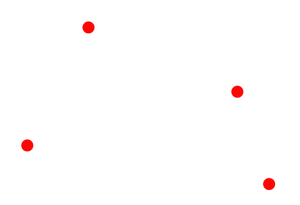
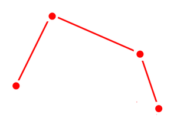
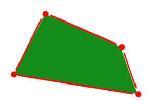
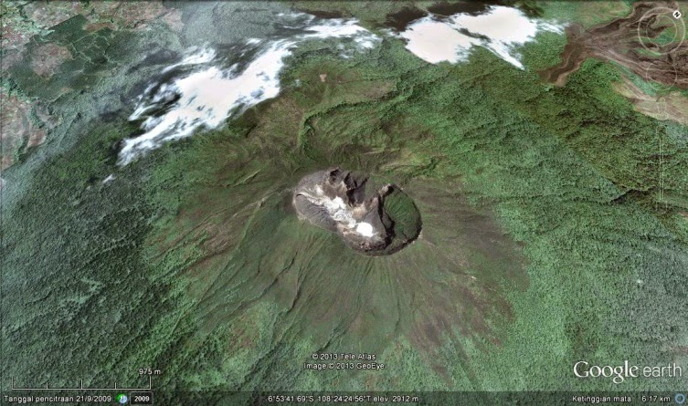

## Latar Belakang Masalah :
1. Data Vektor Geospasial
2. Data Raster Geospasial

## Data Vektor Geospasial
Data vektor terdiri dari simpul dan jalur, dan tiga jenis simbol dasarnya adalah titik, garis dan poligon. 
* Titik

Titik vektor digunakan untuk menampilkan fitur yang terlalu kecil, contoh : pada skala regional, luasan kota dapat ditampilkan sebagai poligon karena kebanyakan detailnya dapat dilihat ketika diperbesar. Tetapi pada skala global, kota dapat direpresentasikan sebagai titik karena detail dari batas kota tidak bisa dilihat. 
* Garis

Garis vektor digunakan untuk menunjukkan rute perjalanan atau sungai dan bisa juga menggambarkan batas wilayah atau batas-batas administratif. Garis vektor dihasilkan dari hubungan titik-titik dengan urutan tertentu.
* Poligon

Poligon merupakan fitur yang memiliki area dua dimensi, contoh : bangunan, bidang pertanian dan daerah administrasi diskrit.

Sejak dulu, peta telah menggunakan simbol untuk menjelaskan fitur dunia nyata dan dalam format vektor bumi digambarkan sebagi suatu mozaik titik, garis dan poligon. Kegunaan data vektor biasanya untuk keperluan peta administratif dan untuk merancang pembangunan jalan dan lain sebagainya.

## Data Raster Geospasial
Data raster terdiri dari piksel juga disebut sebagai sel grid, raster sering terlihat pixelated karena setiap pixel dikaitkan dengan nilai atau kelas. Setiap nilai pixel dalam sebuah foto digital dikaitkan dengan nilai merah, hijau dan biru. Atau setiap nilai dalam model elevasi digital merupakan nilai elevasi. Ini bisa mewakili apa pun dari kategori tematik, ketinggian atau nilai spectral. Model raster berguna untuk menyimpan data yang bervariasi terus menerus, seperti dalam foto udara, permukaan elevasi atau citra satelit. Tapi itu tergantung pada ukuran sel untuk akurasi spasial.

## Kesimpulan
Jadi, kesimpulannya adalah data vektor terdiri dari simpul dan jalur, dan tiga jenis simbol dasarnya adalah titik, garis dan poligon, dan data raster terdiri dari piksel juga disebut sebagai sel grid, raster sering terlihat pixelated karena setiap pixel dikaitkan dengan nilai atau kelas.

## Saran
Mudah-mudahan dipertemuan selanjutnya penjelasannya lebih mendetail lagi dan dibarengi dengan praktikum.

Nama : Bayu Rahmad Azhari
NPM : 1144125
Kelas : 3C
Prodi : D4 Teknik Informatika
Kampus : Politeknik Pos Indonesia

Link Matakuliah : http://kampus.awangga.net/assignments/sisteminformasigeografis2016

Referensi : http://gisgeography.com/spatial-data-types-vector-raster/

Scan Plagiarisme :
* https://drive.google.com/open?id=0B5FSMUsdCMU4Y0FIbktDT1U4TWM
* https://drive.google.com/open?id=0B5FSMUsdCMU4NU4zTnRkczFuMTQ
