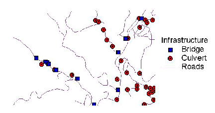
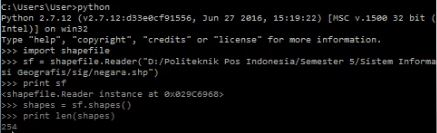

## Latar Belakang Masalah :
1. Data Vektor Geospasial
2. Shapefile Geospasial

## Data Vektor Geospasial
Data vektor terdiri dari simpul dan jalur, dan tiga jenis simbol dasarnya adalah titik, garis dan poligon. Sejak dulu, peta telah menggunakan simbol untuk menjelaskan fitur dunia nyata dan dalam format vektor bumi digambarkan sebagai suatu mozaik titik, garis dan poligon. Kegunaan data vektor biasanya untuk keperluan peta administratif dan untuk merancang pembangunan jalan dan lain sebagainya.

## Shapefile Geospasial
Pembahasan tentang shapefile pertemuan di minggu ini sudah dilakukannnya praktikum, dimana praktikum kemarin kita membahas cara menghitung data jumlah negara dan menerapkannya dengan cara mengimpor shapefile ke python. Shapefile sendiri adalah suatu format data geospasial yang biasa digunakan pada software Sistem Informasi Geografis. Dan dipertemuan kali ini saya juga akan mejelaskan langka-langkah saat praktikum yang telah dilakukan. 
1. Pertama-tama pastikan teman-teman sudah mendownload python terlebih dahulu, jika belum bisa di download di https://www.python.org/downloads/, disini saya menggunakan python versi 2.7.12 dan bisa juga menggunakan python versi lainnya, tapi saya sarankan untuk menggunakan python versi 2 karena directorynya sudah lengkap.
2. Langkah selanjutnya teman-teman juga harus mendownload dan menginstall pip, fungsi pip disini adalah agar kita bisa mencari, menginstall, menguninstall, memanage modul atau package pada instalasi python kita. Untuk file pip sendiri bisa di lihat di https://bootstrap.pypa.io/get-pip.py, dan save filenya di Local Disk (D:) dengan format python dan mengetikkan script pada terminal anda : python “D:\get-pip.py”.
3. Setelah pip terinstall, selanjutnya kita akan menginstall pyshp, dengan cara mengetikan perintah : python -m  pip install pyshp.
4. Setelah itu siapkan dulu file untuk praktikum bisa di lihat di github saya https://github.com/bayurahmadazhari/sistem-informasi-geografis, ambil file yang berformat py dan shp didalam folder praktikum. Kemudian buat folder praktikum di Local Disk (D:) dan simpan file tadi di dalam folder praktikum.
5. Selanjutnya jalankan python pada terminal anda, kemudian import shapefile, dan kemudian akses file shp yang akan diproses, misalkan tadi pada D:/praktikum/negara.shp. Agar lebih mudah bisa melihat gambar dibawah ini :

6. Atau prosesnya bisa juga dijalankan dengan file main.py yang telah disimpan di folder praktikum dan cara menjalankannya : python “D:\praktikum\main.py”. untuk lebih jelasnya silahkan bisa melihat video yang ada di atas.

## Kesimpulan
Jadi, kesimpulan pada pertemuan pagi ini kita membahas bagaimana cara menghitung data jumlah negara dan menerapkannya dengan cara mengimpor shapefile ke python, dan semua proses yang dilakukan sangat mudah pada terminal sistem operasi windows, linux dll.

## Saran
Ikuti proses praktiumnya dengan selangkah demi langkah, agar memudahkan teman-teman untuk memahami langkah-langkah prosesnya dan agar tidak terjadi error.

Nama : Bayu Rahmad Azhari
NPM : 1144125
Kelas : 3C
Prodi : D4 Teknik Informatika
Kampus : Politeknik Pos Indonesia

Link Matakuliah : http://kampus.awangga.net/assignments/sisteminformasigeografis2016

Referensi : http://gisgeography.com/spatial-data-types-vector-raster/

Scan Plagiarisme :
* https://drive.google.com/open?id=0B5FSMUsdCMU4U1hIaHNuN3Q5Tjg
* https://drive.google.com/open?id=0B5FSMUsdCMU4M1lMcFk0QzRKakE
