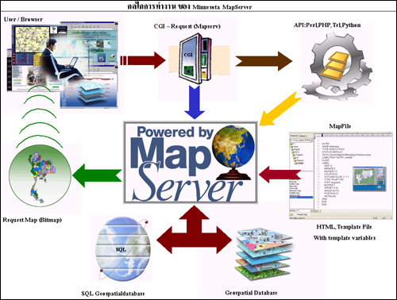

## Latar Belakang Masalah :
1. MapServer
2. Fitur-Fitur MapServer
3. Cara Menginstall MapServer Pada CentOS
4. MapProxy
5. Fitur-Fitur MapProxy
6. Cara Menginstall MapProxy Pada CentOS

## MapServer
MapServer adalah adalah sebuah aplikasi open source yang memungkinkan untuk membangun aplikasi pemetaan web spasial. MapServer ini cepat, fleksibel, dan dapat diandalkan dan dapat diintegrasikan ke semua lingkungan GIS. MapServer pertama kali dikembangkan oleh University of Minnesota, namun sekarang MapServer sudah dikelola oleh pengembang diseluruh dunia. MapServer berjalan pada semua sistem operasi utama dan akan bekerja dengan semua web server. MapServer memiliki Mapscript yang mendukung banyak bahasa populer seperti PHP, Python, Perl, C# dan Java. Menggunakan Mapscript membuatnya cepat dan mudah untuk membangun aplikasi web geospasial yang kompleks.

## Fitur-Fitur MapServer
* Mendukung format data standar industri dan database spasial.
* Klasifikasi fitur secara on the fly.
* Canggih berdasarkan aturan pelabelan.
* Menangani sistem proyeksi data raster dan data vektor secara on the fly.
* Menyediakan berbagai macam spasial dan atribut berdasarkan pertanyaan.
* Mendukung standar Open Geospatial Consortium (OGC) populer seperti WMS, WFS dan WCS.
* Memanfaatkan teknologi best of breed open source geospatial seperti GDAL/OGR, PostGIS dan PROJ.4
* Terintegrasi dengan lingkungan front-end populer seperti ka-Map, Chameleon, Mapbender, MapBuilder dan Cartoweb.

## Cara Menginstall MapServer Pada CentOS
Langkah instalasi MapServer melalui repository elgis dengan menambahkan repository elgis terlebih dahulu, repository elgis juga membutuhkan repository epel.
~~~
# rpm -Uvh http://download.fedoraproject.org/pub/epel/6/x86_64/epel-release-6-8.noarch.rpm
# rpm -Uvh http://elgis.argeo.org/repos/6/elgis-release-6-6_0.noarch.rpm
~~~

Edit file epel.repo tambahkan exclude=armadillo :
~~~
# vi /etc/yum.repos.d/epel.repo
~~~

Instalasi wget :
~~~
# yum install wget
~~~

Instalasi armadillo :
~~~
# wget http://elgis.argeo.org/repos/6/elgis/x86_64/gdal-1.9.2-4.el6.x86_64.rpm
# wget http://proj.badc.rl.ac.uk/cedaservices/raw-attachment/ticket/670/armadillo-3.800.2-1.el6.x86_64.rpm
# yum install armadillo-3.800.2-1.el6.x86_64.rpm
~~~

kemudian lanjutkan proses instalasi :
~~~
# yum install gpsbabel
# yum install gdal
# yum install mapserver
# yum install glibc
# yum install libpng libpng-devel
# yum install gd gd-devel
# yum install giflib-devel
# yum install proj-epsg
# rpm -ql mapserver
# /usr/libexec/mapserver -v
~~~

## MapProxy
MapProxy adalah proxy open source untuk data geospasial. Dan fungsinya mempercepat dan mengubah data dari layanan peta yang ada dan melayani setiap desktop atau web GIS client. MapProxy bisa dibilang cache ubin, tetapi juga menawarkan banyak fitur baru dan inovatif seperti dukungan penuh untuk WMS clients. MapProxy secara aktif dikembangkan dan didukung oleh Omniscale, yang dirilis di bawah Lisensi Apache Software 2.0, dapat berjalan pada Unix/Linux maupun Windows dan mudah untuk menginstal dan mengkonfigurasikannya.

## Fitur-Fitur MapProxy
* MapProxy adalah server ubin (WMS-C, TMS, WMTS, KML SuperOverlays).
* MapProxy juga WMS server yang sepenuhnya kompatibel dan mendukung WMS client (desktop dan web).
* MapProxy dilengkapi dengan API keamanan yang fleksibel yang memungkinkan untuk menambahkan kontrol berbutir di layanan dan lapisan, bahkan dapat membatasi akses dari lapisan tunggal untuk luasan poligon.
* Dapat menghasilkan cache ubin untuk kinerja yang lebih baik, ini disebut seeding.
* Dapat menggunakan MapProxy untuk mengupgrade SDI tanpa menyentuh server yang ada.

## Cara Menginstall MapProxy Pada CentOS
Langkah instalasi MapProxy :
~~~
# yum install python-pip python-devel
# pip install MapProxy
~~~

## Kesimpulan
Jadi, MapServer adalah adalah sebuah aplikasi open source yang memungkinkan untuk membangun aplikasi pemetaan web spasial. MapServer ini cepat, fleksibel, dan dapat diandalkan dan dapat diintegrasikan ke semua lingkungan GIS, dan MapProxy adalah proxy open source untuk data geospasial. Dan fungsinya mempercepat dan mengubah data dari layanan peta yang ada dan melayani setiap desktop atau web GIS client.

## Saran
Diharapkan memahami materi dan praktikumnya secara mendetail dan perhatikan setiap langkah proses instalasi MapServer dan MapProxy dengan baik dan benar.
 
* Nama : Bayu Rahmad Azhari
* NPM : 1144125
* Kelas : 3C
* Prodi : D4 Teknik Informatika
* Kampus : Politeknik Pos Indonesia

Link Matakuliah : http://kampus.awangga.net/assignments/sisteminformasigeografis2016

Referensi :
* http://inigis.com/mengenal-mapserver/
* https://mapproxy.org/
* https://awangga.gitbooks.io/mapserver-untuk-pemula/content/chapter1.html 

Scan Plagiarisme :
* https://drive.google.com/open?id=0B5FSMUsdCMU4clEtYmMtdmhqcmc
* https://drive.google.com/open?id=0B5FSMUsdCMU4dEF6Q2docDV3cm8 