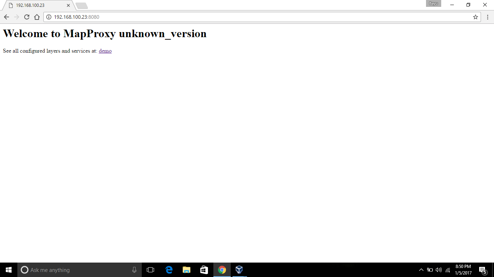
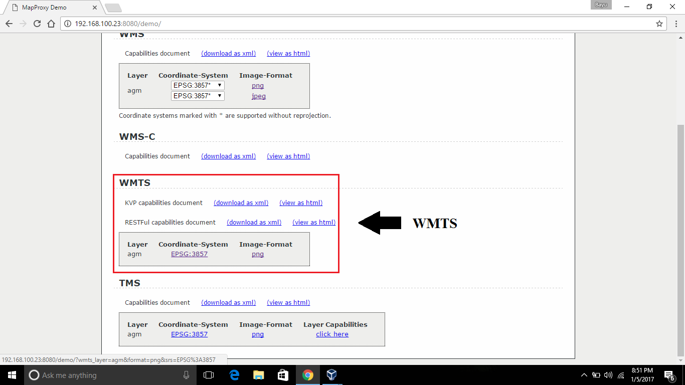
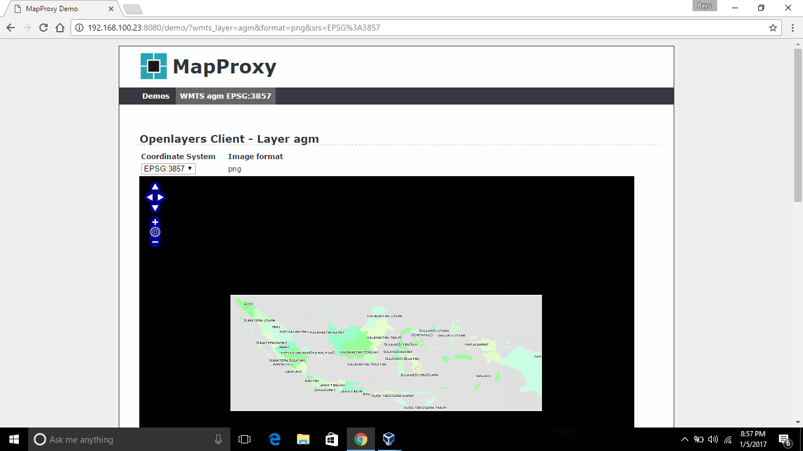

## Latar Belakang Masalah :
1. MapServer
2. MapProxy
3. Konfigurasi MapServer dan MapProxy

## MapServer
MapServer adalah adalah sebuah aplikasi open source yang memungkinkan untuk membangun aplikasi pemetaan web spasial. MapServer ini cepat, fleksibel, dan dapat diandalkan dan dapat diintegrasikan ke semua lingkungan GIS. MapServer pertama kali dikembangkan oleh University of Minnesota, namun sekarang MapServer sudah dikelola oleh pengembang diseluruh dunia. MapServer berjalan pada semua sistem operasi utama dan akan bekerja dengan semua web server. MapServer memiliki Mapscript yang mendukung banyak bahasa populer seperti PHP, Python, Perl, C# dan Java. Menggunakan Mapscript membuatnya cepat dan mudah untuk membangun aplikasi web geospasial yang kompleks.

## MapProxy
MapProxy adalah proxy open source untuk data geospasial. Dan fungsinya mempercepat dan mengubah data dari layanan peta yang ada dan melayani setiap desktop atau web GIS client. MapProxy bisa dibilang cache ubin, tetapi juga menawarkan banyak fitur baru dan inovatif seperti dukungan penuh untuk WMS clients. MapProxy secara aktif dikembangkan dan didukung oleh Omniscale, yang dirilis di bawah Lisensi Apache Software 2.0, dapat berjalan pada Unix/Linux maupun Windows dan mudah untuk menginstal dan mengkonfigurasikannya.

## Konfigurasi MapServer dan MapProxy
Buat direktori dengan nama mapfile pada folder /var/mapdata :
~~~
# mkdir /var/mapdata/mapfile
~~~

Masuk ke folder mapfile:
~~~
# cd /var/mapdata/mapfile
~~~

Buat file dengan nama agm.map :
~~~
# vi agm.map
~~~

Edit file agm.map dengan CTRL + I kemudian isi :
~~~
map
  size 640 480
  imagetype png8
  imagecolor 225 225 225
  shapepath "../shp"
  fontset "/var/mapdata/common/fonts/msfontset.txt"
  projection
    "init=epsg:4326"
  end
  debug on
  web
    imagepath "/var/www/html/tmp/"
    imageurl "/tmp/"
    metadata
      wms_title "Awangga Geo Map"
      wms_srs "EPSG:4326"
      wms_enable_request "*"
      #"ows_onlineresource" "http://localhost/cgi-bin/mapserv?map=/Users/awangga/Sites/mapdata/mapfile/osm.map"
    end
  end
  outputformat
    name "png256"
    driver "AGG/PNG"
    imagemode "pc256"
    extension "png"
  end
  outputformat
    name "png"
    driver "AGG/PNG"
    imagemode "rgba"
    extension "png"
    mimetype "image/png"
    imagemode RGBA
  end
  outputformat
    name "png8"
    driver "AGG/PNG"
    imagemode "rgba"
    extension "png"
    mimetype "image/png"
    imagemode RGBA
    transparent ON
    formatoption "QUANTIZE_FORCE=ON"
    formatoption "QUANTIZE_DITHER=ON"
    formatoption "QUANTIZE_COLORS=250"
  end
  outputformat
    name "jpg"
    driver "AGG/JPEG"
    extension "jpg"
    formatoption "QUALITY=85"
  end

  layer #provinsi layer
    name provinsi
	minscale 500000
    group roads
    type POLYGON
    dump true 
    projection
      "init=epsg:4326"
    end
    #transparency alpha
    status on
    data "00"
    labelitem "PROVINSI"
    classitem "PROVINSI"
    class 
      expression "ACEH"
      style
        color 153 255 153
      end
      label
        color  0 0 0
        outlinecolor 255 255 255
        font "FreeSans"
        type truetype
        size 6
        position lc
        partials true
        mindistance 200
      end
    end
    class 
      expression "SUMATERA UTARA"
      style
        color 204 255 204
      end
      label
        color  0 0 0
        outlinecolor 255 255 255
        font "FreeSans"
        type truetype
        size 6
        position lc
        partials true
        mindistance 200
      end
    end
    class 
      expression "SUMATERA BARAT"
      style
        color 229 255 204
      end
      label
        color  0 0 0
        outlinecolor 255 255 255
        font "FreeSans"
        type truetype
        size 6
        position lc
        partials true
        mindistance 200
      end
    end
    class 
      expression "RIAU"
      style
        color 204 255 229
      end
      label
        color  0 0 0
        outlinecolor 255 255 255
        font "FreeSans"
        type truetype
        size 6
        position lc
        partials true
        mindistance 200
      end
    end
    class 
      expression "JAMBI"
      style
        color 153 255 204
      end
      label
        color  0 0 0
        outlinecolor 255 255 255
        font "FreeSans"
        type truetype
        size 6
        position lc
        partials true
        mindistance 200
      end
    end
    class 
      expression "SUMATERA SELATAN"
      style
        color 153 255 153
      end
      label
        color  0 0 0
        outlinecolor 255 255 255
        font "FreeSans"
        type truetype
        size 6
        position lc
        partials true
        mindistance 200
      end
    end
    class 
      expression "BENGKULU"
      style
        color 204 255 204
      end
      label
        color  0 0 0
        outlinecolor 255 255 255
        font "FreeSans"
        type truetype
        size 6
        position lc
        partials true
        mindistance 200
      end
    end
    class 
      expression "LAMPUNG"
      style
        color 229 255 204
      end
      label
        color  0 0 0
        outlinecolor 255 255 255
        font "FreeSans"
        type truetype
        size 6
        position lc
        partials true
        mindistance 200
      end
    end
    class 
      expression "KEPULAUAN BANGKA BELITUNG"
      style
        color 204 255 229
      end
      label
        color  0 0 0
        outlinecolor 255 255 255
        font "FreeSans"
        type truetype
        size 6
        position lc
        partials true
        mindistance 200
      end
    end
    class 
      expression "KEPULAUAN RIAU"
      style
        color 153 255 204
      end
      label
        color  0 0 0
        outlinecolor 255 255 255
        font "FreeSans"
        type truetype
        size 6
        position lc
        partials true
        mindistance 200
      end
    end
    class 
      expression "DKI JAKARTA"
      style
        color 153 255 153
      end
      label
        color  0 0 0
        outlinecolor 255 255 255
        font "FreeSans"
        type truetype
        size 6
        position lc
        partials true
        mindistance 200
      end
    end
    class 
      expression "JAWA BARAT"
      style
        color 204 255 204
      end
      label
        color  0 0 0
        outlinecolor 255 255 255
        font "FreeSans"
        type truetype
        size 6
        position lc
        partials true
        mindistance 200
      end
    end
    class 
      expression "JAWA TENGAH"
      style
        color 229 255 204
      end
      label
        color  0 0 0
        outlinecolor 255 255 255
        font "FreeSans"
        type truetype
        size 6
        position lc
        partials true
        mindistance 200
      end
    end
    class 
      expression "DAERAH ISTIMEWA YOGYAKARTA"
      style
        color 204 255 229
      end
      label
        color  0 0 0
        outlinecolor 255 255 255
        font "FreeSans"
        type truetype
        size 6
        position lc
        partials true
        mindistance 200
      end
    end
    class 
      expression "JAWA TIMUR"
      style
        color 153 255 204
      end
      label
        color  0 0 0
        outlinecolor 255 255 255
        font "FreeSans"
        type truetype
        size 6
        position lc
        partials true
        mindistance 200
      end
    end
    class 
      expression "BANTEN"
      style
        color 153 255 153
      end
      label
        color  0 0 0
        outlinecolor 255 255 255
        font "FreeSans"
        type truetype
        size 6
        position lc
        partials true
        mindistance 200
      end
    end
    class 
      expression "BALI"
      style
        color 204 255 204
      end
      label
        color  0 0 0
        outlinecolor 255 255 255
        font "FreeSans"
        type truetype
        size 6
        position lc
        partials true
        mindistance 200
      end
    end
    class 
      expression "NUSA TENGGARA BARAT"
      style
        color 229 255 204
      end
      label
        color  0 0 0
        outlinecolor 255 255 255
        font "FreeSans"
        type truetype
        size 6
        position lc
        partials true
        mindistance 200
      end
    end
    class 
      expression "NUSA TENGGARA TIMUR"
      style
        color 204 255 229
      end
      label
        color  0 0 0
        outlinecolor 255 255 255
        font "FreeSans"
        type truetype
        size 6
        position lc
        partials true
        mindistance 200
      end
    end
    class 
      expression "KALIMANTAN BARAT"
      style
        color 153 255 204
      end
      label
        color  0 0 0
        outlinecolor 255 255 255
        font "FreeSans"
        type truetype
        size 6
        position lc
        partials true
        mindistance 200
      end
    end
    class 
      expression "KALIMANTAN TENGAH"
      style
        color 153 255 153
      end
      label
        color  0 0 0
        outlinecolor 255 255 255
        font "FreeSans"
        type truetype
        size 6
        position lc
        partials true
        mindistance 200
      end
    end
    class 
      expression "KALIMANTAN SELATAN"
      style
        color 204 255 204
      end
      label
        color  0 0 0
        outlinecolor 255 255 255
        font "FreeSans"
        type truetype
        size 6
        position lc
        partials true
        mindistance 200
      end
    end
    class 
      expression "KALIMANTAN TIMUR"
      style
        color 229 255 204
      end
      label
        color  0 0 0
        outlinecolor 255 255 255
        font "FreeSans"
        type truetype
        size 6
        position lc
        partials true
        mindistance 200
      end
    end
    class 
      expression "KALIMANTAN UTARA"
      style
        color 204 255 229
      end
      label
        color  0 0 0
        outlinecolor 255 255 255
        font "FreeSans"
        type truetype
        size 6
        position lc
        partials true
        mindistance 200
      end
    end
    class 
      expression "SULAWESI UTARA"
      style
        color 153 255 204
      end
      label
        color  0 0 0
        outlinecolor 255 255 255
        font "FreeSans"
        type truetype
        size 6
        position lc
        partials true
        mindistance 200
      end
    end
    class 
      expression "SULAWESI TENGAH"
      style
        color 153 255 153
      end
      label
        color  0 0 0
        outlinecolor 255 255 255
        font "FreeSans"
        type truetype
        size 6
        position lc
        partials true
        mindistance 200
      end
    end
    class 
      expression "SULAWESI SELATAN"
      style
        color 204 255 204
      end
      label
        color  0 0 0
        outlinecolor 255 255 255
        font "FreeSans"
        type truetype
        size 6
        position lc
        partials true
        mindistance 200
      end
    end
    class 
      expression "SULAWESI TENGGARA"
      style
        color 229 255 204
      end
      label
        color  0 0 0
        outlinecolor 255 255 255
        font "FreeSans"
        type truetype
        size 6
        position lc
        partials true
        mindistance 200
      end
    end
    class 
      expression "GORONTALO"
      style
        color 204 255 229
      end
      label
        color  0 0 0
        outlinecolor 255 255 255
        font "FreeSans"
        type truetype
        size 6
        position lc
        partials true
        mindistance 200
      end
    end
    class 
      expression "SULAWESI BARAT"
      style
        color 153 255 204
      end
      label
        color  0 0 0
        outlinecolor 255 255 255
        font "FreeSans"
        type truetype
        size 6
        position lc
        partials true
        mindistance 200
      end
    end
    class 
      expression "MALUKU"
      style
        color 153 255 153
      end
      label
        color  0 0 0
        outlinecolor 255 255 255
        font "FreeSans"
        type truetype
        size 6
        position lc
        partials true
        mindistance 200
      end
    end
    class 
      expression "MALUKU UTARA"
      style
        color 204 255 204
      end
      label
        color  0 0 0
        outlinecolor 255 255 255
        font "FreeSans"
        type truetype
        size 6
        position lc
        partials true
        mindistance 200
      end
    end
    class 
      expression "PAPUA BARAT"
      style
        color 229 255 204
      end
      label
        color  0 0 0
        outlinecolor 255 255 255
        font "FreeSans"
        type truetype
        size 6
        position lc
        partials true
        mindistance 200
      end
    end
    class 
      expression "PAPUA"
      style
        color 204 255 229
      end
      label
        color  0 0 0
        outlinecolor 255 255 255
        font "FreeSans"
        type truetype
        size 6
        position lc
        partials true
        mindistance 200
      end
    end
  end #layer provinsi

  #layer kabkot indonesia
  LAYER
    NAME base_map
	group roads
    TYPE POLYGON
    STATUS ON
    DATA "00"
    POSTLABELCACHE FALSE
    PROCESSING "LABEL_NO_CLIP=ON"
    LABELCACHE ON
    LABELITEM "KABKOT"
    CLASS
      #minscale 10000
      maxscale 500000
      Name "indonesia_kab"
      STYLE
        COLOR 102 255 102
        OUTLINECOLOR 200 200 200
        SYMBOL 0
      END
      LABEL
        COLOR  0 0 0
        OUTLINECOLOR 255 255 255
        FONT "FreeSans"
        TYPE truetype
        SIZE 8
        POSITION CC
        PARTIALS TRUE
        MINDISTANCE 50
        REPEATDISTANCE 9999
      END
    END
    METADATA
      "DESCRIPTION"   "Peta Indonesia"
    END
  END #layer kabkot indonesia

  layer #pois_a layer 
    name pois_a
    group roads
    type POLYGON
    dump true 
    projection
      "init=epsg:4326"
    end
    transparency alpha
    status on
    data pois_a
    labelitem "name"
    classitem "fclass"
    class 
     minscale 100000
     maxscale 500000
     style
        color 0 0 0
        OUTLINECOLOR 200 200 200
        SYMBOL 0
      end
      style
        color 230 230 250
        OUTLINECOLOR 0 0 0
        SYMBOL 0
      end
    end
    class
     maxscale 50000
     style
        color 0 0 0
        OUTLINECOLOR 0 0 0
        SYMBOL 0
      end
      style
        color 230 230 250
        OUTLINECOLOR 0 0 0
        SYMBOL 0
      end
     label
        type truetype
        antialias true
        font arialbd
        size 8
        position auto
     	angle follow 
        color 255 255 255
        outlinecolor 64 64 64
        buffer 30
        partials false
      end
    end

    class   
     maxscale 100000
     minscale 50000
     style
        color 0 0 0
        OUTLINECOLOR 0 0 0
        SYMBOL 0
      end
      style
        color 230 230 250
        OUTLINECOLOR 0 0 0
        SYMBOL 0
      end
      label
        type truetype
        antialias true
        font arialbd
        size 8
        position cc
        color 255 255 255
        outlinecolor 64 64 64
        buffer 30
        partials false
      end
    end
  end #pois_a layer

  layer #Default Segment roads
    name default_segment
    group roads
    type line
    dump true 
    projection
      "init=epsg:4326"
    end
    transparency alpha
    status on
    data roads
    labelitem "name"
    classitem "fclass"
    class 
     minscale 100000
     maxscale 500000
     style
        color 0 0 0
        width 3 
        antialias true
      end
      style
        color 255 255 153
        width 0.1 
        antialias true
      end
    end
    class
     maxscale 50000
     style
        color 0 0 0
        width 6 
        antialias true
      end
      style
        color 255 255 153
        width 4 
        antialias true
      end
     label
        type truetype
        antialias true
        font arialbd
        size 8
        position auto
     	angle follow 
        color 255 255 255
        outlinecolor 64 64 64
        buffer 30
        partials false
      end
    end

    class   
     maxscale 100000
     minscale 50000
     style
        color 0 0 0
        width 4
        antialias true
      end
      style
        color 255 255 153
        width 2
        antialias true
      end
      label
        type truetype
        antialias true
        font arialbd
        size 8
        position cc
        color 255 255 255
        outlinecolor 64 64 64
        buffer 30
        partials false
      end
    end
  end #default_segment layer

  layer
    name segments 
    group roads
    type line
    projection
      "init=epsg:4326"
    end
    transparency alpha
    status on
    data roads
    labelitem "name"
    classitem "fclass"

    # motorway 
    class
      maxscale 500000
      expression "motorway"  
      style
        color 0 0 0  
        width 8 
        antialias true
      end
      style
        color 128 155 192 
        width 6  
        antialias true
      end

      label
        type truetype
        antialias true
        font arialbd
        size 8
        position cc
        color 255 255 255
        outlinecolor 64 64 64
        buffer 30
        partials false
      end
    end  
    class
      maxscale 500000
      expression "primary"
      style
        color 0 0 0  
        width 6 
        antialias true
      end
      style
        color 127 201 127 
        width 4 
        antialias true
      end
      label
        type truetype
        antialias true
        font arialbd
        size 8
        position cc
	angle follow
        color 255 255 255
        outlinecolor 64 64 64
        buffer 30
        partials false
      end
    end

    class
      maxscale 500000
      expression "secondary"
      style
        color 0 0 0
        width 4 
        antialias true
      end
      style
        color 253 191 111
        width 2  
        antialias true
      end

      label
        type truetype
        antialias true
        font arialbd
        size 8
        position cc
        color 255 255 255
        outlinecolor 64 64 64
        buffer 30
        partials false
      end
    end 
   end #layer segment

end
~~~

Masuk ke folder mapfile:
~~~
# cd /var/mymapproxy
~~~

Buat file dengan nama mapproxy.yaml :
~~~
# vi mapproxy.yaml
~~~

Edit file mapproxy.yaml dengan CTRL + I kemudian isi :
~~~
services:
  demo:
  tms:
    use_grid_names: true
    # origin for /tiles service
    origin: 'nw'
  kml:
      use_grid_names: true
  wmts:
    # use restful access to WMTS
    restful: true
    # this is the default template for MapProxy
    restful_template: '/{Layer}/{TileMatrixSet}/{TileMatrix}/{TileCol}/{TileRow}.{Format}'
    # and also allow KVP requests
    kvp: true
    md:
      # metadata used in capabilities documents for WMTS
      # if the md option is not set, the metadata of the WMS will be used
      title: Awangga GeoMap
      abstract: This is the Awangga GeoMap.
      online_resource: http://www.awangga.net/
      contact:
        person: Rolly Maulana Awangga
        position: Software Engineer
        organization: Belant Persada
        address: Jl. Ligar Nyawang No.2
        city: Bandung
        postcode: 40191
        country: Indonesia
        phone: +62(0)813-12000-300
        fax: +62(0)813-12000-300
        email: rolly@awang.ga
      # multiline strings are possible with the right indention
      access_constraints:
        This service is intended for Sekretariat Negara Only.
        The data is under development on Sekretarian Negara Republik Indonesia.
        (http://setneg.go.id/)
      fees: 'None'
  wms:
    md:
      title: MapProxy WMS Proxy
      abstract: This is a minimal MapProxy example.

layers:
  - name: agm
    title: Awangga Geo Map - www.awangga.net
    sources: [agm_cache]

caches:
  agm_cache:
    grids: [webmercator]
    sources: [agm_source]

sources:
  agm_source:
    type: mapserver
    req:
      layers: roads
      map: /var/mapdata/mapfile/agm.map
    coverage:
      bbox: [94.5011475, -11.007385, 141.01947, 6.076721]
      srs: 'EPSG:4326'
    mapserver:
      binary: /usr/libexec/mapserver
      working_dir: /var/mapdata/tmp
    supported_srs: ['EPSG:4326']

grids:
    webmercator:
        base: GLOBAL_WEBMERCATOR

globals:
~~~

Setelah itu kita coba jalankan maproxy dengan perintah :
~~~
# mapproxy-util serve-develop mapproxy.yaml -b 0.0.0.0
~~~

Kemudian buka demonya dibrowser dengan menggunakan ip address pada sistem operasi centOS pada virtual, misalkan http://192.168.100.23:8080/, kemudian pilih demo :

Kemudian pada bagian WTMS pilih png pada Image-Format :

Selanjutnya akan muncul Openlayers Client – Layer agm :

## Kesimpulan
Jadi, MapServer adalah adalah sebuah aplikasi open source yang memungkinkan untuk membangun aplikasi pemetaan web spasial. MapServer ini cepat, fleksibel, dan dapat diandalkan dan dapat diintegrasikan ke semua lingkungan GIS, dan MapProxy adalah proxy open source untuk data geospasial. Dan fungsinya mempercepat dan mengubah data dari layanan peta yang ada dan melayani setiap desktop atau web GIS client.

## Saran
Diharapkan memahami materi dan praktikumnya secara mendetail dan perhatikan setiap langkah proses instalasi MapServer dan MapProxy dengan baik dan benar.
 
* Nama : Bayu Rahmad Azhari
* NPM : 1144125
* Kelas : 3C
* Prodi : D4 Teknik Informatika
* Kampus : Politeknik Pos Indonesia

Link Matakuliah : http://kampus.awangga.net/assignments/sisteminformasigeografis2016

Referensi :
* http://inigis.com/mengenal-mapserver/
* https://mapproxy.org/
* https://awangga.gitbooks.io/mapserver-untuk-pemula/content/chapter1.html 

Scan Plagiarisme :
* https://drive.google.com/open?id=0B5FSMUsdCMU4clEtYmMtdmhqcmc
* https://drive.google.com/open?id=0B5FSMUsdCMU4dEF6Q2docDV3cm8 